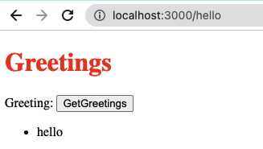

# HELLO RAILS REACT

For this project, I used react-rails gem. This gem allows to buiild React components as a part of rails JS and serve it as a react_component, to be use in a regular ERB file.

For this proyect, information is retrieve from the data base using an API, and showing random greetings messages.

## Live Version
Under construction

## Built With

- HTML&CSS
- Javascript
- React
- Rails

## Getting Started
To get a local copy up and running follow these simple steps.

### Setup
 

### Install
- Open your console and change the current working directory into the destination for this project.
- Type `git clone git@github.com:JasemDuncan/hello-rails-react.git`
- Type Enter to finish the installation process.
- Run command in terminal: npm build
- Run command in terminal: bundle install
- Run command in terminal: rails db:setup
- Run command in terminal: rails db:seed
- Run command in terminal: rails s -p 3000
- Run command in terminal: ./bin/webpack-dev-server 
- Go to: http://localhost:3000/hello

## Authors

👤 **Jasem Duncan Valencia**

- GitHub: [@JasemDuncan](https://github.com/JasemDuncan)
- Twitter: [@JasemDuncan](https://twitter.com/JasemDuncan)
- LinkedIn: [@JasemDuncan](https://www.linkedin.com/in/jasem-duncan-valencia/)
## 🤝 Contributing

Contributions, issues, and feature requests are welcome!

Feel
## Show your support

Give a ⭐️ if you like this project!
## Acknowledgments

- Microverse for the guidelines used for this project
- My SO and project manager, Mane
## 📝 License

This project is [MIT](./LICENSE.md) licensed.
